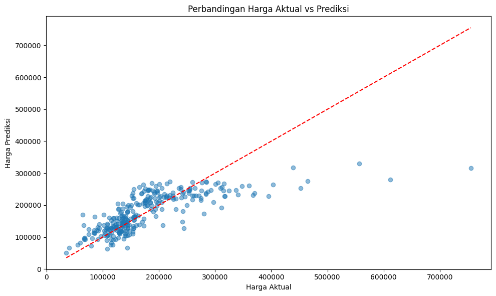
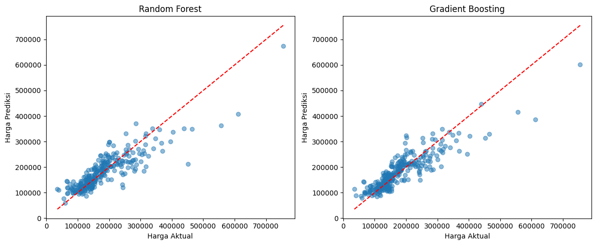

# linear regresi & random forest 

melakukan prediksi dari house price dengan menggunakan beberapa metode 

1. cleaning data (prep)
2. correlaion (feature engineering)
3. model (model)

# linear regression 

# Random Forest , Gradient Boosting
